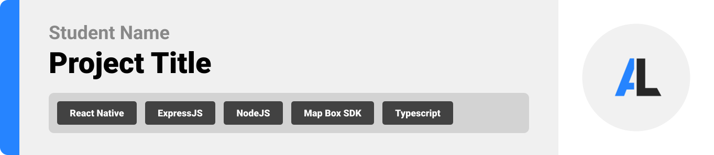

<br><br>

<!-- project philosophy -->


> An innovative platform designed for athletes to showcase their achievements, connect with coaches, clubs, and fellow athletes, and take their careers to the next level.
>
> AthLink streamlines networking for athletes by offering features like virtual tryouts, real-time updates, and blockchain-based achievement verification, ensuring authenticity and ease of access. AthLink to empower athletes by saving time and creating meaningful connections that drive success.

### User Stories

#### User

- As a user, I want to connect with other athletes, clubs, and federations.
- As a user, I want to create a profile to showcase my achievements.
- As a user, I want live updates to stay informed about events and opportunities.
- As a user, I want to chat with my connections.

#### Club

- As a club, I want to create virtual tryouts events.
- As a club, I want to request a trophy verification from federations.

#### Athlete

- As an athlete, I want to join virtual tryouts to display my skills.
- As an athlete, I want to request a trophy verification from federations.

#### Federation

- As a federation, I want to approve trophies for clubs and athletes.

<br><br>

<!-- Tech stack -->


### AthLink is built using the following technologies:

- This project uses [ReactJS](https://react.dev/) with [TypeScript](https://www.typescriptlang.org/) for the frontend. React is a JavaScript library for building dynamic and interactive user interfaces, and TypeScript adds static typing, improving code quality and maintainability.
- For the backend, the project uses [Node.js](https://nodejs.org/en) with [Express.js](https://expressjs.com/), both written in TypeScript, providing a fast and scalable server-side framework for handling API requests and routing.
- The blockchain functionality is implemented using [Hardhat](https://hardhat.org/) and [Solidity](https://soliditylang.org/). Hardhat is a development environment for Ethereum, and Solidity is the smart contract programming language. All blockchain-related code is also written in TypeScript for consistency and better development experience.
- For persistent storage, the project uses [MySQL](https://www.mysql.com/) with [TypeORM](https://typeorm.io/), a TypeScript-based ORM. This ensures type safety when defining entities and interacting with the database, while efficiently handling structured data.

<br><br>

<!-- UI UX -->


> AthLink was designed by sketching wireframes and mockups, refining them until the layout was simple and easy to use.

- Project Figma design [figma](https://www.figma.com/design/u8iZ0DJwwUpwmVqQ152vdw/UI-UX-Assignments?node-id=260-1702&t=H47oHMIAlvy2OCb3-1)

### Mockups

| Home screen                             | Menu Screen                           | Order Screen                          |
| --------------------------------------- | ------------------------------------- | ------------------------------------- |
|  |  |  |

<br><br>

<!-- Database Design -->


### Architecting Data Excellence: Innovative Database Design Strategies:

- Insert ER Diagram here

<br><br>

<!-- Implementation -->


### User Screens (Mobile)

| Login screen                              | Register screen                         | Landing screen                          | Loading screen                          |
| ----------------------------------------- | --------------------------------------- | --------------------------------------- | --------------------------------------- |
|  |  |  |  |
| Home screen                               | Menu Screen                             | Order Screen                            | Checkout Screen                         |
|  |  |  |  |

### Admin Screens (Web)

| Login screen                            | Register screen                       | Landing screen                        |
| --------------------------------------- | ------------------------------------- | ------------------------------------- |
|  |  |  |
| Home screen                             | Menu Screen                           | Order Screen                          |
|  |  |  |

<br><br>

<!-- Prompt Engineering -->


### Mastering AI Interaction: Unveiling the Power of Prompt Engineering:

- This project uses advanced prompt engineering techniques to optimize the interaction with natural language processing models. By skillfully crafting input instructions, we tailor the behavior of the models to achieve precise and efficient language understanding and generation for various tasks and preferences.

<br><br>

<!-- AWS Deployment -->


### Efficient AI Deployment: Unleashing the Potential with AWS Integration:

- This project leverages AWS deployment strategies to seamlessly integrate and deploy natural language processing models. With a focus on scalability, reliability, and performance, we ensure that AI applications powered by these models deliver robust and responsive solutions for diverse use cases.

<br><br>

<!-- Unit Testing -->


### Precision in Development: Harnessing the Power of Unit Testing:

- This project employs rigorous unit testing methodologies to ensure the reliability and accuracy of code components. By systematically evaluating individual units of the software, we guarantee a robust foundation, identifying and addressing potential issues early in the development process.

<br><br>

<!-- How to run -->


> To set up Coffee Express locally, follow these steps:

### Prerequisites

This is an example of how to list things you need to use the software and how to install them.

- npm
  ```sh
  npm install npm@latest -g
  ```

### Installation

_Below is an example of how you can instruct your audience on installing and setting up your app. This template doesn't rely on any external dependencies or services._

1. Get a free API Key at [example](https://example.com)
2. Clone the repo
   git clone [github](https://github.com/your_username_/Project-Name.git)
3. Install NPM packages
   ```sh
   npm install
   ```
4. Enter your API in `config.js`
   ```js
   const API_KEY = "ENTER YOUR API";
   ```

Now, you should be able to run Coffee Express locally and explore its features.
