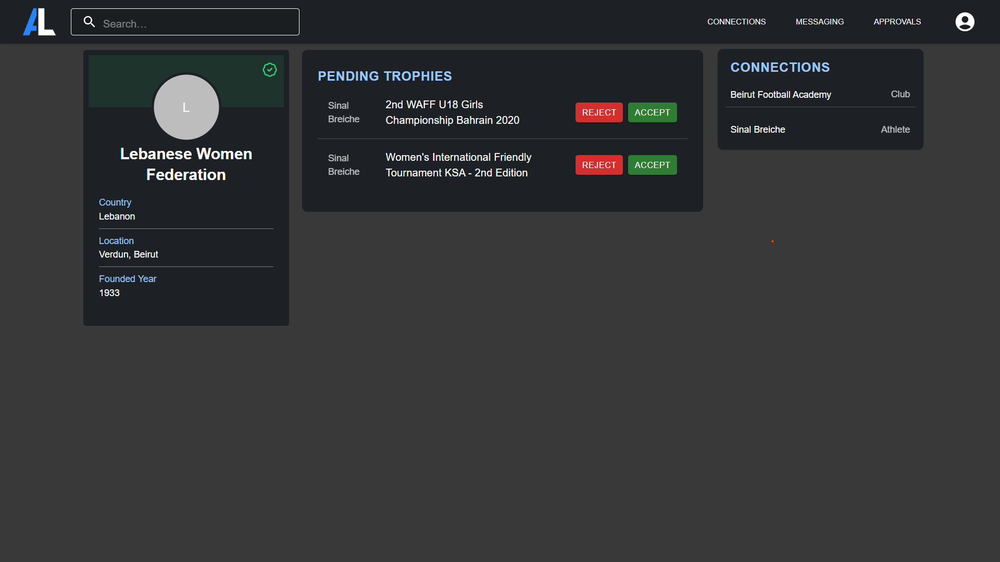

<br><br>

<!-- project philosophy -->


> An innovative platform designed for athletes to showcase their achievements, connect with coaches, clubs, and fellow athletes, and take their careers to the next level.
>
> AthLink streamlines networking for athletes by offering features like virtual tryouts, chat messaging, and blockchain-based achievement verification, ensuring authenticity and ease of access. AthLink to empower athletes by saving time and creating meaningful connections that drive success.

### User Stories

#### User

- As a user, I want to connect with other athletes, clubs, and federations so that I can expand my network.
- As a user, I want to create a profile to showcase my achievements so that others can view my progress.
- As a user, I want live updates to stay informed about events and opportunities so that I don't miss out on important activities.
- As a user, I want to chat with my connections so that I can communicate easily.

#### Club

- As a club, I want to create virtual tryout events so that athletes can display their skills.
- I want to request a trophy verification from federations so that I can confirm achievements.

#### Athlete

- As an athlete, I want to join virtual tryouts to display my skills so that clubs can see my potential.
- As an athlete, I want to request a trophy verification from federations so that I can validate my accomplishments.

#### Federation

- As a federation, I want to approve trophies for clubs and athletes so that achievements are officially recognized.

<br><br>

<!-- Tech stack -->


### AthLink is built using the following technologies:

- This project uses [ReactJS](https://react.dev/) with [TypeScript](https://www.typescriptlang.org/) for the frontend. React is a JavaScript library for building dynamic and interactive user interfaces, and TypeScript adds static typing, improving code quality and maintainability.
- For the backend, the project uses [Node.js](https://nodejs.org/en) with [Express.js](https://expressjs.com/), both written in TypeScript, providing a fast and scalable server-side framework for handling API requests and routing.
- The blockchain functionality is implemented using [Hardhat](https://hardhat.org/) and [Solidity](https://soliditylang.org/). Hardhat is a development environment for Ethereum, and Solidity is the smart contract programming language. All blockchain-related code is also written in TypeScript for consistency and better development experience.
- For persistent storage, the project uses [MySQL](https://www.mysql.com/) with [TypeORM](https://typeorm.io/), a TypeScript-based ORM. This ensures type safety when defining entities and interacting with the database, while efficiently handling structured data.

<br><br>

<!-- UI UX -->


> AthLink was designed by sketching wireframes and mockups, refining them until the layout was simple and easy to use.

- Project Figma design [figma](https://www.figma.com/design/u8iZ0DJwwUpwmVqQ152vdw/UI-UX-Assignments?node-id=260-1702&t=H47oHMIAlvy2OCb3-1)

### Mockups

| Athlete Profile screen              | Chat Screen                       |
| ----------------------------------- | --------------------------------- |
|  |  |

<br><br>

<!-- Database Design -->


### Architecting Data Excellence: Innovative Database Design Strategies:


<br><br>

<!-- Implementation -->


### Athlete Screens (Web)

| Profile                               | Tryout                                |
| ------------------------------------- | ------------------------------------- |
|  |  |

### Features Screens

| Chat Screen                         | Smart Notes                       |
| ----------------------------------- | --------------------------------- |
|  |  |

### Club Screens

|                                       |                                       |
| ------------------------------------- | ------------------------------------- |
|  |  |

### Coach | Federation Screens

|                                       |                                       |
| ------------------------------------- | ------------------------------------- |
|  |  |

<br><br>

<!-- How to run -->


> To set up AthLink locally, follow these steps:

### Prerequisites

This is an example of how to list things you need to use the software and how to install them.

- npm
  ```sh
  npm install npm@latest -g
  ```

### Installation

_Below is an example of how you can instruct your audience on installing and setting up your app. This template doesn't rely on any external dependencies or services._

1. Get a free API Key at [example](https://example.com)
2. Clone the repo
   git clone [github](https://github.com/your_username_/Project-Name.git)
3. Install NPM packages
   ```sh
   npm install
   ```
4. Enter your API in `config.js`
   ```js
   const API_KEY = "ENTER YOUR API";
   ```

Now, you should be able to run Coffee Express locally and explore its features.
