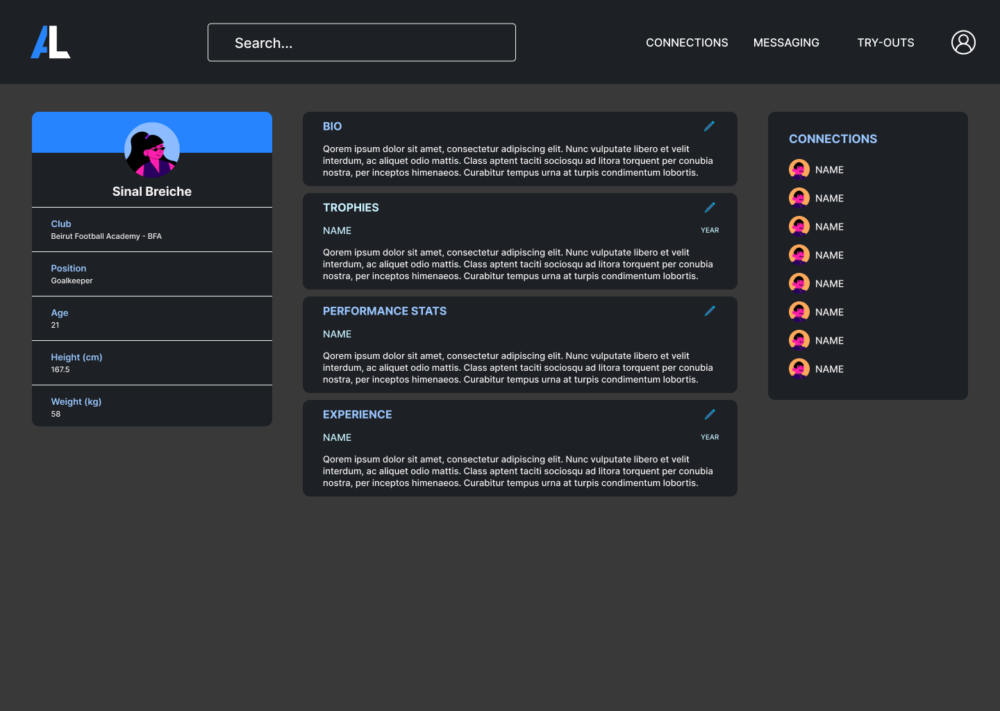
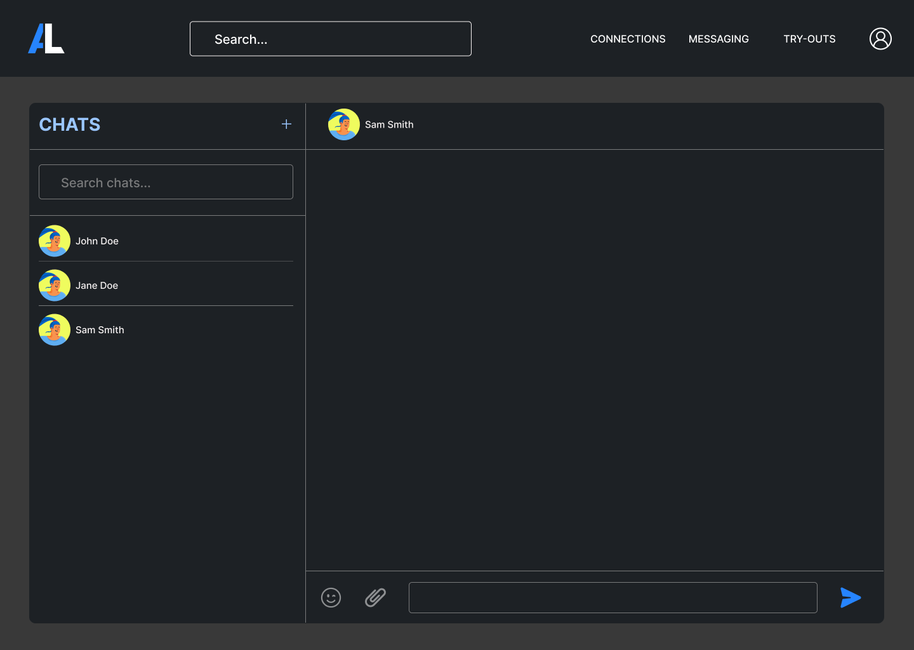
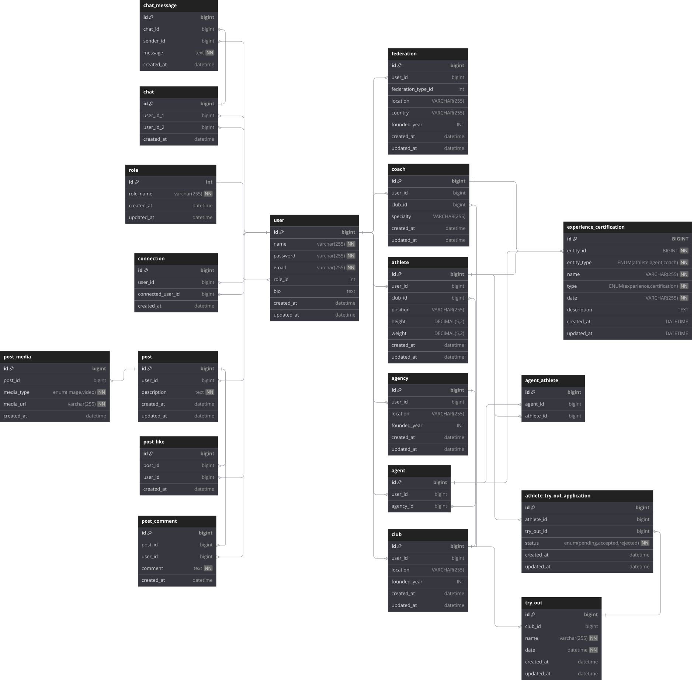
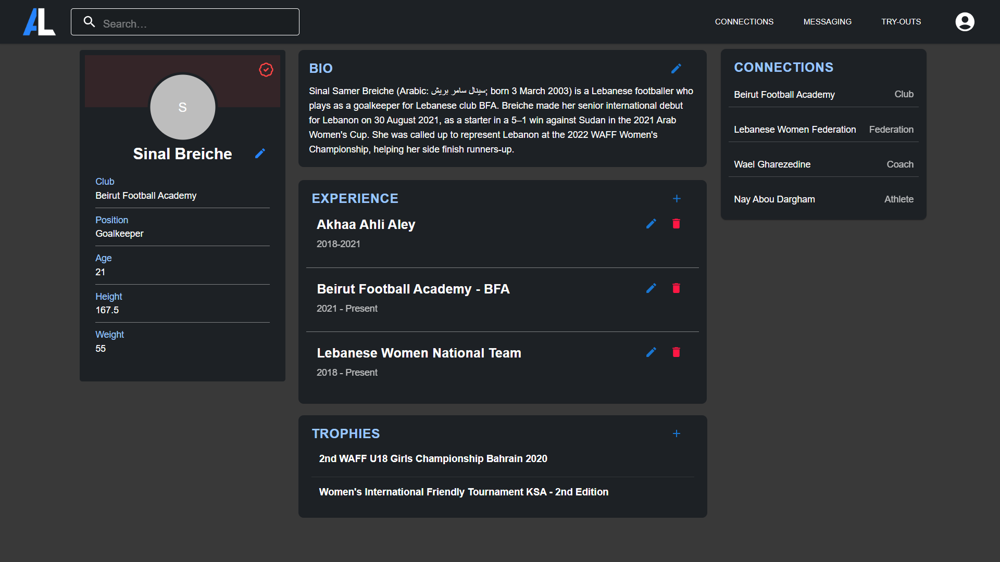
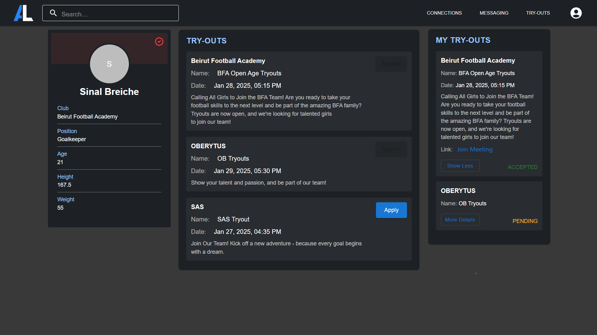
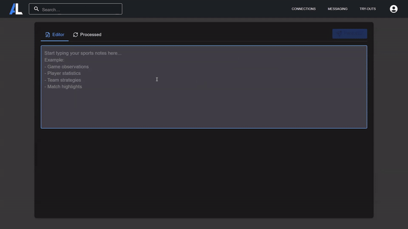
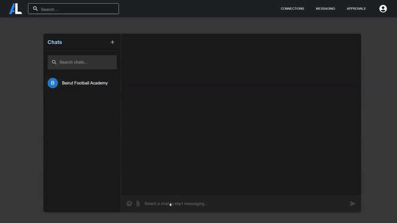
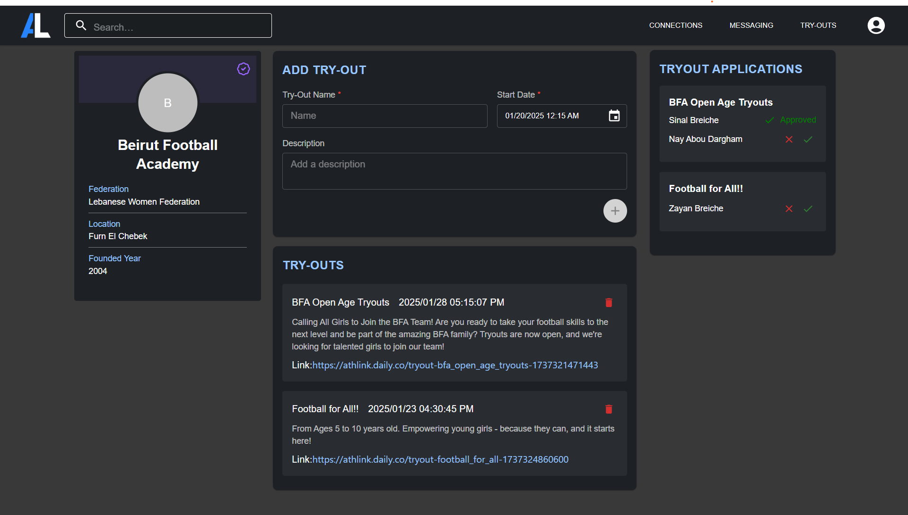
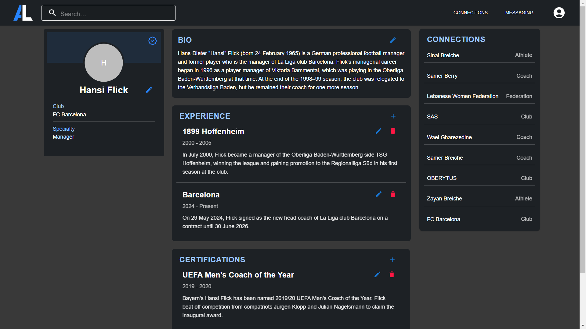

<br><br>

<!-- project philosophy -->


> An innovative platform designed for athletes to showcase their achievements, connect with coaches, clubs, and fellow athletes, and take their careers to the next level.
>
> AthLink streamlines networking for athletes by offering features like virtual tryouts, chat messaging, and blockchain-based achievement verification, ensuring authenticity and ease of access. Clubs can use AI to organize and structure unorganized notes related to athletes' virtual tryouts, saving time and creating meaningful connections.

### User Stories

#### User

- As a user, I want to connect with other athletes, clubs, and federations so that I can expand my network.

- As a user, I want to create a profile to showcase my achievements so that others can view my progress.

- As a user, I want to stay informed about events and opportunities so that I don't miss out on important activities.

- As a user, I want to chat with my connections so that I can communicate easily.

#### Club

- As a club, I want to create virtual tryout events so that athletes can display their skills.

- As a club, I want to write unstructured notes so they can be processed and organized into a clear format.

#### Athlete

- As an athlete, I want to join virtual tryouts to display my skills so that clubs can see my potential.

- As an athlete, I want to request a trophy verification from federations so that I can validate my accomplishments.

#### Federation

- As a federation, I want to approve trophies for clubs and athletes so that achievements are officially recognized.

<br><br>

<!-- Tech stack -->


### AthLink is built using the following technologies:

- Frontend: the project uses [ReactJS](https://react.dev/) with [TypeScript](https://www.typescriptlang.org/). React is a JavaScript library for building dynamic and interactive user interfaces, and TypeScript adds static typing.

- Backend: the project is built with [Node.js](https://nodejs.org/en) and [Express.js](https://expressjs.com/), both implemented in TypeScript. Node.js is a runtime environment for JavaScript and Express.js is a web application framework that runs on top of Node.js.

- The blockchain functionality is implemented using [Hardhat](https://hardhat.org/) and [Solidity](https://soliditylang.org/). Hardhat is a development environment for Ethereum, and Solidity is the smart contract programming language. All blockchain-related code is also written in TypeScript for consistency.

- Database: the project uses [MySQL](https://www.mysql.com/) with [TypeORM](https://typeorm.io/), a TypeScript-based ORM. This ensures type safety when defining entities and interacting with the database.

<br><br>

<!-- UI UX -->


> AthLink was designed by sketching wireframes and mockups.

- Project Figma design [figma](https://www.figma.com/design/u8iZ0DJwwUpwmVqQ152vdw/UI-UX-Assignments?node-id=260-1702&t=H47oHMIAlvy2OCb3-1)

### Mockups

| Athlete Profile screen                | Chat Screen                        |
| ------------------------------------- | ---------------------------------- |
|  |  |

<br><br>

<!-- Database Design -->


### Architecting Data Excellence: Innovative Database Design Strategies:



<br><br>

<!-- Implementation -->


### Athlete Screens

|                                       |                                              |
| ------------------------------------- | -------------------------------------------- |
|  |  |

### Features

|                                             |                                               |
| ------------------------------------------- | --------------------------------------------- |
|  |  |

### Club | Coach Screens

|                                              |                                       |
| -------------------------------------------- | ------------------------------------- |
|  |  |

<br><br>

<!-- How to run -->


> To set up AthLink locally, follow these steps:

### Prerequisites

Before you begin, ensure you have the following installed:

- Node.js (v18.0.0 or higher)

- npm (latest version)

- npm
  ```sh
  npm install npm@latest -g
  ```
- Git

### Installation

1. Clone the repo
   git clone [github](https://github.com/BreicheSinal/athlink)
2. Frontend Setup (React Application)

   2.1 Navigate to frontend directory

   ```sh
   cd athlink/app
   ```

   2.2. Install dependencies

   ```sh
   npm install
   ```

   2.3. Start development server

   ```sh
   npm run start
   ```

3. Backend Setup (Node.js Server)

   3.1 Navigate to backend directory

   ```sh
   cd ../server
   ```

   3.2. Install dependencies

   ```sh
   npm install
   ```

   3.3. Build and start the server

   ```sh
   npm run serve
   ```

4. Blockchain Setup (Hardhat Project)

   4.1 Navigate to blockchain directory

   ```sh
   cd ../blockchain
   ```

   4.2. Install dependencies

   ```sh
   npm install
   ```

   4.3. Run local hardhat node (optional)

   ```sh
   npx hardhat node
   ```

### Environment Variables

Make sure to set up the following environment variables:

- Frontend (.env)

  ```sh
  VITE_SERVER_PORT=your_server_port
  ```

- Backend (.env)

  ```sh
  PORT=3000
  SERVER_PORT=your_server_port
  DB_HOST=localhost
  DB_USER=root
  DB_PASSWORD=your_password
  DB_NAME=your_db_name
  DB_PORT=3306  JWT_SECRET=your_jwt_secret
  OPENAI_API_KEY=your_openai_api_key
  DAILY_API_KEY=your_daily_co_api_key
  RPC_URL=your_rpc_url_string
  ```

- Blockchain (.env)

  ```sh
  LOCALHOST_URL=your_localhost_url_string
  ```

### Development

To run the entire stack locally:

1. Start the frontend development server:

   ```sh
   cd app
   npm run start
   ```

2. Start the backend server:

   ```sh
   cd server
   npm run serve
   ```

3. Start local blockchain node (if needed):

   ```sh
   cd blockchain
   npx hardhat node
   ```

### Build

To build for production:

1. Frontend:

   ```sh
   cd app
   npm run build
   ```

2. Start the backend server:

   ```sh
   cd server
   npm run build
   ```

Now you should be able to run the entire AthLink application locally and explore its features. Make sure all services (frontend, backend, and blockchain node) are running simultaneously for full functionality ;)
